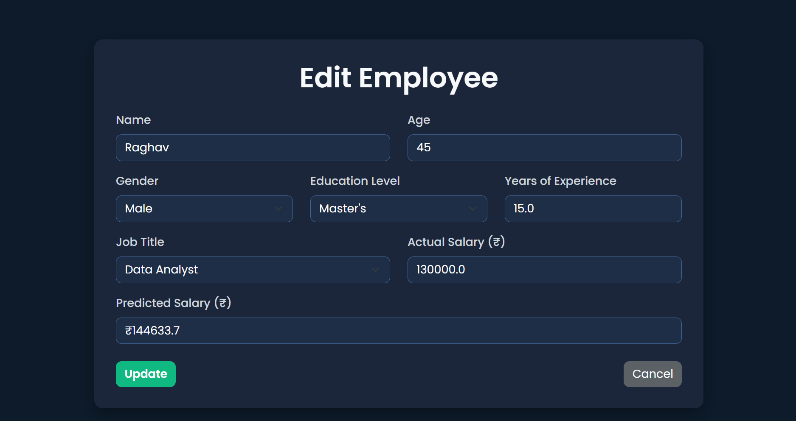

# PayPredict: Employee Salary Prediction and Management System

**PayPredict** is a responsive HR analytics web application designed to support HR teams in managing employee records and predicting monthly salaries. It considers essential factors including age, gender, education, job title, and experience.

## Home View:


## Employee Records View:


## Employee Records With Filters View:


## Add Employee View:


## Edit Employee View:



## Salary Insights Dashboard View:


---

## Key Features

* **CRUD Employee Records**
  Full support for adding, viewing, updating, and deleting employee profiles. Each record includes both actual and predicted salary values.
  
* **Filterable & Searchable Table**
  Quickly locate employees using:

  * Search by **name**
  * Multi‑filters: **Job Title**, **Gender**, **Education**
  * Salary range filters (**Min/Max Actual Salary**)
  * Dynamic result counter showing how many entries match your criteria

* **Bulk CSV Upload & Export**
  Efficiently import large datasets in CSV format and export records to CSV or Excel for reporting or analysis.

* **Interactive Dashboard**
  Provides dynamic filtering and insightful visual summaries:

  * **KPI Cards**: Total Employees | Average Actual Salary | Average Predicted Salary | Prediction Accuracy (R²)
  * **Filters**: Job Title | Gender | Education Level
  * **Visual Insights**:

    * **Scatter Chart** – Actual vs Predicted Salaries
    * **Horizontal Bar Chart** – Average Salary by Job Title
    * **Doughnut Chart** – Salary Distribution by Gender
    * **Line Chart** – Experience vs Average Salary
    * **Histogram** – Employee Age Distribution
    * **100% Stacked Bar** – Gender Ratio per Job Title

* **Real‑Time Salary Prediction**
  Users can obtain salary predictions instantly while entering employee data—before confirming the record.

* **Robust Machine Learning Integration**
  Backed by a trained Gradient Boosting model (0.90+ R² score) with target encoding for accurate and reliable salary forecasts.


## Tech Stack

- **Backend**: Python, Flask, SQLAlchemy  
- **Model**: scikit‑learn (Gradient Boosting), `category_encoders`  
- **Frontend**: HTML, Bootstrap 5, Chart.js, JavaScript  
- **Database**: SQLite  
- **Data I/O**: pandas for CSV and Excel handling

---

## Project Structure

```
PayPredict/
├── app.py
├── requirements.txt
├── model/
│   ├── salary\_predictor\_gb.pkl
│   └── target\_encoder.pkl
├── templates/
│   ├── index.html
│   ├── edit\_employee.html
│   ├── employees\_table.html
│   └── dashboard.html
│   └── confirm.html
├── static/
│   ├── css/style.css
│   └── js/dashboard.js
├── instance/
│   └── database.db
├── README.md
├── Salary_Data.csv
└── SalaryPrediction.ipynb

````

---

## Setup Instructions

1. **Clone the repository:**
```bash
git clone https://github.com/Diya050/PayPredict.git
cd PayPredict
````

2. **Set up a virtual environment:**

```bash
python -m venv venv
source venv/bin/activate        # macOS/Linux
venv\Scripts\activate           # Windows PowerShell
```

3. **Install dependencies:**

```bash
pip install -r requirements.txt
```

4. **Run the application:**

```bash
python app.py
```

5. **Open your browser:** At [http://127.0.0.1:5000](http://127.0.0.1:5000).


---

## Web App Previews

Check out live UI previews in the [Previews folder](https://github.com/Diya050/PayPredict/tree/main/Previews).

---

## About the Author

**Diya Baweja**<br>
GitHub: [@Diya050](https://github.com/Diya050)

---

> Upgrade your HR analytics with **PayPredict** — precise, professional, and powerful.

